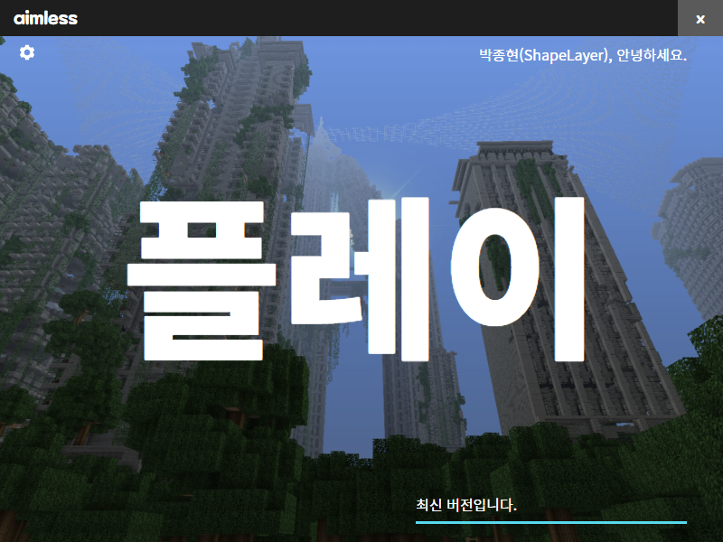

# Minecraft Mod Patcher
  

A Simple Minecraft mod patch application based on Electron. It was developed to play the moded Minecraft with friends right after the KSAT. Some of the code is hardcoded because I didn't intend to recycle it.  

## External Works
This repo uses or contains external work. Some have been changed to alternative works, but some must be downloaded and applied directly.  
 * Maplestory Font (Bold) - `./assets/fonts/Maplestory Bold.ttf` - Nexon _(Need to Apply)_
 * Noto Sans CJK KR _(Need to Apply)_
   * `./assets/fonts/NotoSansCJKkr-Black.otf`
   * `./assets/fonts/NotoSansCJKkr-Bold.otf`
   * `./assets/fonts/NotoSansCJKkr-Regular.otf`
 * Grossgasteiger - `./assets/bg.jpg` - Eberhard, [Pexels](https://www.pexels.com/photo/aerial-photography-of-pine-trees-1292115/)